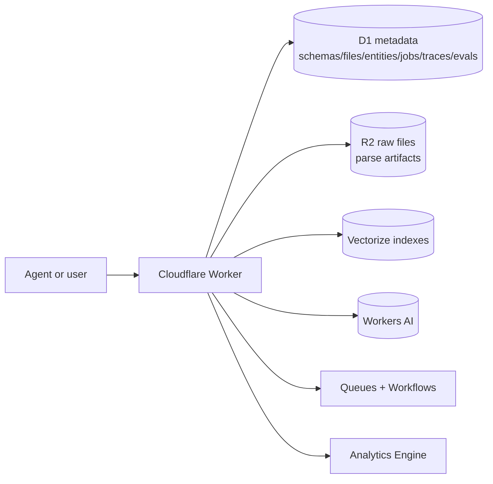

# Knowledgebase Cloudflare Design

`knowledgebase` owns the fleet `RAG_SERVICE` as a Cloudflare Worker. The current
product runtime is TypeScript/Node on Cloudflare: Hono routes, D1 metadata,
Vectorize retrieval, R2 raw/parse artifacts, Queues/Workflows ingestion, Workers
AI for embeddings and optional rerank/synthesis/OCR, and a Worker-hosted `/ui`
testing surface.

## Runtime

## Ingestion

- `/v1/kb/files/upload` stores raw bytes in R2, records file/job state in D1,
  and queues Worker-native ingestion.
- `/v1/kb/ingest/record` and `/v1/kb/ingest/text` cover direct structured and
  text inputs without a local Python service.
- URL and EDGAR imports run through Worker fetch into R2/D1.
- Parser coverage includes text, JSON/NDJSON, CSV, HTML, digital PDF text/table
  rows, XLSX, DOCX, PPTX, Markdown Conversion fallback, and opt-in vision OCR.

## Retrieval

The old Qdrant BM42 path is replaced by a Cloudflare-native hybrid path:

- D1 exact structured routes and relationship graph expansion.
- Vectorize dense search.
- D1 fuzzy sparse lexical prefilter/scoring.
- RRF fusion, MMR, deterministic rewrite/decompose fanout.
- Optional Workers AI rerank and answer synthesis.
- Extractive cited answers by default, with evidence-bound synthesis fallback.

## Testing Surface

The Worker serves `/ui` for upload, schema, session, answer, source-set, queued
run progress, trace export/comparison, retrieval eval, answer eval, parse eval,
and query controls.

## Remaining Non-Cloudflare Surface

`cloudflare/full-port-gaps.json` is the executable blocker inventory. At the
time of writing, Python retirement is complete: the old Python FastAPI server,
Python UI, Docker Compose runtime, parser/query/eval package, package metadata,
and root pytest suite have been removed. The remaining blockers are the
scanned-PDF OCR parity decision and retiring the sibling `rag-service` folder
after parity is proven.
