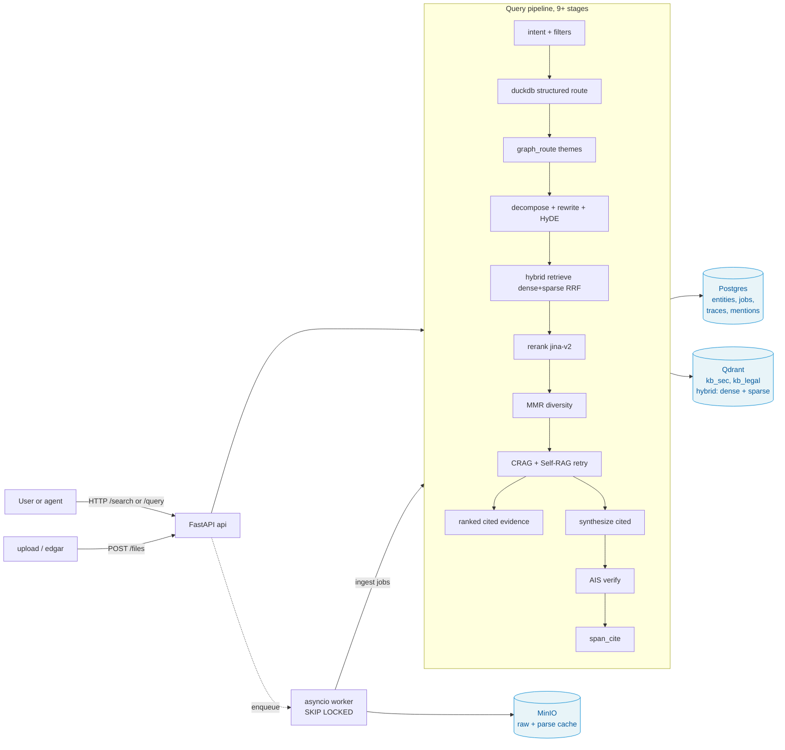

# Private Agent Search

[](https://github.com/sarthak-fleet/knowledge-base/actions/workflows/ci.yml)
[](#)
[](#)

Exa-style search for private, specialized document collections, with schemas,
citations, and provenance for agents.

Bring your own project and documents, or start from the included SEC/legal
templates. Drop in research papers, company private information, spreadsheets,
manuals, contracts, notes, filings, and other niche sources; infer/confirm a
schema; then expose them through a cited search API (`/search`) and a grounded
answer API (`/query`).

The wedge is intentionally narrower than "generic RAG":

- Exa searches the open web; this searches your private/specialized corpus.
- Agents get ranked cited evidence directly, not only a chat response.
- Schemas make extraction and filtering explicit when the corpus has domain shape.
- Schema inference can start from representative uploaded files before ingestion.
- Every useful response points back to file, page, and excerpt.

## What's interesting about this one

**Verified across 5 LLMs × 2 unrelated domains** (SEC EDGAR filings + SPDX legal licenses), with one counter-intuitive empirical result:

> On this RAG pipeline, **`groq-llama-3.1-8b` beats `gemini-2.5-pro` by 24 pass-rate points** on SEC. Bigger models hedge, smaller decisive ones don't — when retrieval is solid, the synthesis model becomes a rephrase-and-commit job that cheap models do *better*.

This inversion is **contingent on retrieval quality**: the cheap-decisive synth is a retrieval-quality multiplier (NOTES.md §4.7, line 316). With reranker+RRF off, the 8b model would happily commit to wrong sources and the result flips. The right framing isn't "8b wins" — it's "no fixed model wins; the right synth depends on whether your context is solid enough that decisiveness pays off."

Three other moments documented honestly in `LEARNING.md`:
1. The DuckDB structured-query route was silently broken for 5 eval rounds (missing dep + import outside try) — every aggregate question 500'd, eval logged as `query_error`, all v0-v5 numbers achieved despite this. Caught by loud-error-logging, fixed.
2. A methodology bug — `docker compose exec -e AI_MODEL=...` doesn't propagate to the API server, so 3 supposedly-different cross-model eval runs were the same model under different labels. Caught when two report files had identical MD5.
3. A citation-hygiene gap I introduced in my own GraphRAG sketch (entity-graph themes shaped the answer but their `entity_mentions` weren't in the citation list) — caught it in self-review, closed it before shipping.

The project mantra **"cited or it didn't happen"** holds through every retrieval path: hybrid + structured DuckDB + GraphRAG-sketch + Self-RAG retry + vision-LLM tables, all wired to terminate at a retrievable `(file_id, page, excerpt)` triple.

## Reading guide

Sorted by how much time you have:

**5 min — the rubric write-up**
- [`WRITEUP.md`](WRITEUP.md) — 4-page submission write-up: architecture diagram, three trickiest decisions, what I'd do differently, where it breaks. This is what to read if you're scoring against the assignment.

**Post-submission additions** (after the original deliverable shipped):
- [`SESSION_LOG.md`](SESSION_LOG.md) — what changed since: project namespace, cross-kind retrieval, unified `/ingest/*` endpoints, project-aware Streamlit UI, the OpenAI-client memory-leak fix, configurable reranker.

**15 min — decision depth + the empirical headline**
1. [`LEARNING.md`](LEARNING.md) Part 4 (decision log) — every architectural choice, why, what surfaced it. Includes the 4 production bugs called out above.
2. [`LEARNING.md`](LEARNING.md) Part 8 (five distilled lessons) — what to take away.
3. [`NOTES.md`](NOTES.md) §4.7-final — the cross-domain × cross-model matrix that drives the headline finding.

**60 min — full deep dive**
- [`NOTES.md`](NOTES.md) — long-form engineering notes (~25 pages): every decision, the research behind each choice, the empirical numbers at each step. Source-of-truth appendix to WRITEUP.md.
- [`DESIGN.md`](DESIGN.md) — architecture detail + boundary tests for domain-agnosticism.

**Operator-flavored**
- [`docs/runbook.md`](docs/runbook.md) — operator runbook
- [`docs/demo-walkthrough.md`](docs/demo-walkthrough.md) — guided demo
- [`docs/onboard-new-domain.md`](docs/onboard-new-domain.md) — adding a third domain in ~30 min
- [`docs/agent-search-direction.md`](docs/agent-search-direction.md) — product direction + gap map for private agent search
- [`docs/bring-your-own-corpus.md`](docs/bring-your-own-corpus.md) — self-serve private corpus flow
- [`docs/agent-tool-contract.md`](docs/agent-tool-contract.md) — how agents should call `/search` and `/query`

**Appendix**
- [`LIVE_VERIFICATION.md`](LIVE_VERIFICATION.md) — recorded live-run output of the eval pipeline.
- [`GROK_FINDINGS.md`](GROK_FINDINGS.md) — external code review (13 findings, all resolved).
- [`docs/highsignal-integration.md`](docs/highsignal-integration.md) — integration notes.

## Architecture



Two demo domains (SEC + Legal) run on the **same code** with completely different schemas, sources, and eval sets — proves domain-agnosticism empirically, not aspirationally. See [`docs/onboard-new-domain.md`](docs/onboard-new-domain.md) for a 30-minute walkthrough of adding a third.

## One-command bootstrap

```bash
cp .env.example .env   # fill in AI_API_KEY (DeepSeek default, free-AI gateway also configured)
make up                # docker compose up -d --build  (postgres, qdrant, minio, api, worker, streamlit)
make seed              # SEC: schema + 10 EDGAR filings + digital PDF + scanned (OCR) PDF + XLSX
make seed-legal        # LEGAL: schema + 6 SPDX license texts (MIT, Apache-2.0, GPL-3.0, BSD-3, MPL-2.0, ISC)
make seed-all          # both
make eval              # 25-question SEC eval (citation P/R + LLM judge + RAGAS metrics)
make eval-legal        # 12-question legal eval
```

The `api` container runs `python -m kb.cli db init` on startup to apply migrations idempotently — no manual setup.

**Image footprint** — the built image is ~8 GB. The non-obvious chunk is ~2 GB of pre-warmed fastembed model weights (dense embedder, sparse, cross-encoder reranker) baked in during `docker build`. This is deliberate: the first `/query` would otherwise pay a ~25 s reranker-load + ~2 GB download on a fresh container, and sparse/reranker silently degrade if the network is slow. If you'd rather mount a persistent volume for the model cache, set `FASTEMBED_CACHE_DIR` to a mounted path and skip the pre-warm step in `docker/Dockerfile`.

Then open:

- API + Swagger → http://localhost:8000/docs
- Streamlit agent-search UI → http://localhost:8501
- Prometheus metrics → http://localhost:8000/metrics
- MinIO console → http://localhost:9001
- Qdrant dashboard → http://localhost:6333/dashboard

## Try it from the command line

The six most interesting endpoints, copy-paste-ready:

```bash
# 1. Health check (DB + vector store + object store probes)
curl -s http://localhost:8000/readyz | jq

# 2. Infer a schema from representative files before ingestion
curl -s -X POST http://localhost:8000/schemas/infer/files \
  -F project=default \
  -F domain=research-papers \
  -F stage_files=true \
  -F "files=@paper.pdf" \
  | jq '{domain, sample_count, staged_files: (.staged_files | length)}'

# 3. Agent-native cited search on the SEC corpus, no answer synthesis
curl -s -X POST http://localhost:8000/search \
  -H 'Content-Type: application/json' \
  -d '{"domain":"sec","query":"NVIDIA U.S. export controls","top_k":3}' \
  | jq '.results[] | {rank, filename, page_start, excerpt}'

# 4. Cited answer on the SEC corpus
curl -s -X POST http://localhost:8000/query \
  -H 'Content-Type: application/json' \
  -d '{"domain":"sec","question":"What does NVIDIA disclose about U.S. export controls?"}' \
  | jq '{answer, citations: [.citations[] | {filename, page_start, excerpt}], confidence}'

# 5. The full trace for that answer (every stage, every latency, every token count)
curl -s "http://localhost:8000/query/traces?domain=sec&limit=1" | jq '.[0].id' \
  | xargs -I {} curl -s "http://localhost:8000/query/trace/{}" | jq '.filters._stages'

# 6. The same question on the Legal domain — same code, different schema
curl -s -X POST http://localhost:8000/query \
  -H 'Content-Type: application/json' \
  -d '{"domain":"legal","question":"What permission does the MIT License grant?"}' \
  | jq '.answer'
```

| Endpoint | What it does |
| --- | --- |
| `POST /search` | Agent-native cited search; returns ranked evidence with file, page, excerpt |
| `POST /agent/search` | Alias for `/search` when wiring agent tools |
| `POST /query` | Run the full 9-stage pipeline; returns cited answer + confidence + trace_id |
| `POST /query/stream` | Same, but as Server-Sent Events with per-stage progress |
| `GET /query/traces?domain=X` | List recent query traces with timings + token usage |
| `GET /query/trace/{id}` | Full per-stage record for one query (auditable) |
| `POST /files` | Upload a doc; enqueues an ingest job |
| `GET /ingest/jobs?domain=X` | Job queue state |
| `POST /schemas/infer` | Propose a schema from sample chunks (Phase-2, opt-in) |
| `POST /schemas/infer/files` | Upload representative files, parse samples, infer schema, optionally stage files |
| `GET /metrics` | Prometheus-format counters + summaries |
| `GET /readyz` | DB + vector + object store readiness probe |

## How this was built — AI-assistance disclosure

Built with heavy assist from Claude Opus 4.7 (visible as the co-author on commits). Being explicit about the split:

| What I owned | What was collaborated |
| --- | --- |
| Architecture decisions (Postgres + Qdrant + MinIO split, schema-driven extraction, 9-stage pipeline shape) | Implementation mechanics for each stage |
| Scope boundaries (which features to ship, which to cancel — e.g., the explicit cancel + reasoning on task #82 retrieval iteration) | Library swap mechanics (instructor, structlog, prometheus_client migration) |
| When to debug vs when to defer (the cross-model methodology bug → re-run with proper env propagation; the DuckDB ticker→canonical→noise-floor chain) | Code-level refactors |
| Citation hygiene as a non-negotiable across new routes (caught my own GraphRAG-citation gap in self-review) | Test scaffolding, doc rewrites |
| The empirical methodology (5×2 matrix, judge held constant, deterministic LLM cache for reproducibility) | Doc generation from my notes |

The decision log in `LEARNING.md` was written from my own session notes; it's what I'd talk through in an interview.

## Libraries used (intentionally, not "look mum a library")

11 well-known libraries adopted in this codebase, each replacing hand-rolled scaffolding with a known-good standard:

| Library | What it replaced |
| --- | --- |
| `instructor` | hand-rolled `chat_json` + JSON-schema dicts + defensive parsing at 5 LLM call sites |
| `prometheus_client` | ~85-line hand-rolled metrics aggregator |
| `structlog` | stdlib `logging.getLogger` across 32 modules; JSON in prod, console in TTY |
| `asgi-correlation-id` | request_id threaded through every log line via context-var |
| `cachetools` | manual FIFO dict eviction in `vector/embed.py` (Grok #9) |
| `aiolimiter` | gateway 429 retry-cascade prevention |
| `orjson` | stdlib JSON in FastAPI response path |
| `uvloop` | stdlib asyncio loop |
| `pre-commit` | trailing-whitespace, EOF, YAML/TOML/JSON validity, debug-statement detector, private-key detector |
| `pytest-cov` + `mypy` | coverage + type-check signal in CI |
| `ruff format` | format gate in CI |

## What's in the source tree

| Path | What |
| --- | --- |
| `src/kb/schema/` | User-defined schema (entities, fields, NL descriptions, relationships, versioning) |
| `src/kb/parse/` | Unstructured-based parsing + content-hash element cache + opt-in vision-LLM table extraction |
| `src/kb/extract/` | Schema-driven extraction via OpenAI-compatible LLM (instructor); per-field provenance |
| `src/kb/resolve/` | Entity resolution: deterministic identity keys + rapidfuzz + embedding tiebreak |
| `src/kb/vector/` | Qdrant (default, hybrid dense+sparse via RRF) or pgvector |
| `src/kb/query/` | 9-stage pipeline + GraphRAG-sketch route + DuckDB structured route + Self-RAG retry |
| `src/kb/sources/` | Source-adapter Protocol; `edgar`, `upload` built-in; pluggable |
| `src/kb/jobs/` | Asyncio worker pool against Postgres job table (`SKIP LOCKED`) |
| `src/kb/api/` | FastAPI surface — Swagger at `/docs`, readiness at `/readyz`, metrics at `/metrics` |
| `src/kb/config/` | Layered config — `defaults.yaml` < `domains/<d>/config.yaml` < env |
| `src/kb/observability.py` | structlog + uvloop bootstrap, called once at process start |
| `src/kb/eval/` | Eval runner: deterministic citation P/R + LLM-judge + RAGAS-shaped metrics + disk cache |
| `domains/sec/` | Demo schema + config + 25-question eval set for SEC EDGAR filings |
| `domains/legal/` | Demo schema + config + 12-question eval set for SPDX licenses |
| `migrations/` | Postgres schema (extensions, tables, indexes), idempotent SQL |
| `streamlit_app/` | Single-page demo UI |
| `tests/` | 108 unit + integration tests, ruff + ruff-format + mypy in CI |

## Performance

Per-stage latency on SEC across a real eval run (25 questions, `gemini-2.5-flash` synth, `gemini-2.5-pro` judge, ~3-hop pipeline including DuckDB + GraphRAG-sketch routes):

| Stage          | Typical p50 (ms) | Notes |
| -------------- | ---------------: | ----- |
| `intent`       |              ~3 000 | Cached when KB_LLM_CACHE_DIR is set; warm calls < 5 ms |
| `duckdb`       |                 ~600 | LLM-generated SQL over in-memory DuckDB views |
| `graph_route`  |             ~18 000 | Fires only on theme-shape questions |
| `rewrite`      |             ~10 000 | Multi-query expansion + HyDE; parallel-friendly |
| `retrieve`     |                 ~300 | Qdrant hybrid (dense + sparse + RRF) |
| `rerank`       |             ~9 000 | Cross-encoder (jina-v2 base) on CPU; first call ~25 s incl. model load |
| `mmr`          |                  ~5 | Pure-Python diversity reranker over the rerank pool |
| `crag`         |                  ~4 | Cache hit; cold ~14 s |
| `self_rag`     |                   0 | Triggered only when `crag_score < 0.4`; bounded to 1 retry per request |
| `synthesize`   |             ~12 000 | The single biggest spend; varies wildly with model + context size |
| `verify`       |             ~16 000 | AIS entailment per claim |
| `span_cite`    |                 ~400 | Per-citation best-span via dense cosine over chunk text |

End-to-end p50 ≈ **30 s warm**, **80 s cold** (first request loads embedder + reranker). Reproduce with:

```bash
python scripts/bench.py --domain sec --n 25
```

For sub-second response, the right architecture is per-token streaming (the SSE endpoint exists; it doesn't yet stream per-token — see `LEARNING.md` Part 7). Costs trade against latency: enable `KB_LLM_CACHE_DIR` for deterministic replay and zero LLM cost on repeated queries; this is what makes eval iteration practical.

## Configurability (no domain values in source)

Everything pipeline-related is configurable in `domains/<name>/config.yaml`:

```yaml
llm:
  extract: { model: deepseek-chat, temperature: 0.0 }
  synthesize: { model: deepseek-chat, temperature: 0.2 }
embedding:
  dense: BAAI/bge-small-en-v1.5
  sparse: Qdrant/bm42-all-minilm-l6-v2-attentions
retrieve:
  top_k_dense: 20
  top_k_sparse: 20
  rerank_top_k: 8
  selfrag_threshold: 0.4
  graph_route_enabled: true
```

## Swapping domains

```bash
make schema-apply   # for any domains/<name>/schema.yaml
# then POST /files with your domain= and the pipeline takes over.
```

No code change required to onboard a new domain — see `DESIGN.md` for the boundary tests.
