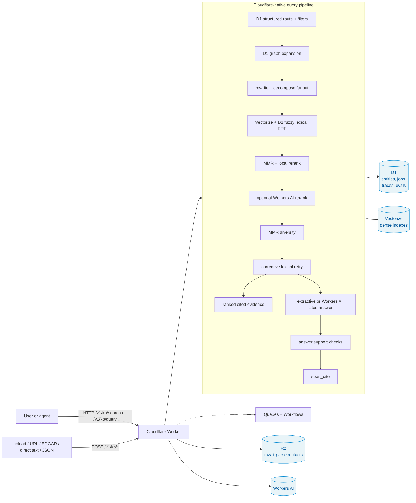

# Private Agent Search

[](https://github.com/sarthak-fleet/knowledge-base/actions/workflows/ci.yml)
[](#)

Exa-style search for private, specialized document collections, with schemas,
citations, and provenance for agents.

This repo also owns the Cloudflare-native shared RAG Worker in
`cloudflare/worker`. That Worker is the fleet `RAG_SERVICE`: service-key
authenticated ingestion/query APIs backed by Workers AI, Vectorize, D1, and R2.

Bring your own project and documents, or start from the included SEC/legal
templates. Drop in research papers, company private information, spreadsheets,
manuals, contracts, notes, filings, and other niche sources; infer/confirm a
schema; then expose them through a cited search API (`/search`) and a grounded
answer API (`/query`).

The wedge is intentionally narrower than "generic RAG":

- Exa searches the open web; this searches your private/specialized corpus.
- Agents get ranked cited evidence directly, not only a chat response.
- Schemas make extraction and filtering explicit when the corpus has domain shape.
- Schema inference can start from representative uploaded files before ingestion.
- Every useful response points back to file, page, and excerpt.

## What's interesting about this one

**Verified across 5 LLMs × 2 unrelated domains** (SEC EDGAR filings + SPDX legal licenses), with one counter-intuitive empirical result:

> On this RAG pipeline, **`groq-llama-3.1-8b` beats `gemini-2.5-pro` by 24 pass-rate points** on SEC. Bigger models hedge, smaller decisive ones don't — when retrieval is solid, the synthesis model becomes a rephrase-and-commit job that cheap models do *better*.

This inversion is **contingent on retrieval quality**: the cheap-decisive synth is a retrieval-quality multiplier (NOTES.md §4.7, line 316). With reranker+RRF off, the 8b model would happily commit to wrong sources and the result flips. The right framing isn't "8b wins" — it's "no fixed model wins; the right synth depends on whether your context is solid enough that decisiveness pays off."

Three historical moments documented honestly in `LEARNING.md`:
1. The DuckDB structured-query route was silently broken for 5 eval rounds (missing dep + import outside try) — every aggregate question 500'd, eval logged as `query_error`, all v0-v5 numbers achieved despite this. Caught by loud-error-logging, fixed.
2. A methodology bug in the retired Python reference stack — process-level env overrides did not propagate to the running API server, so 3 supposedly-different cross-model eval runs were the same model under different labels. Caught when two report files had identical MD5.
3. A citation-hygiene gap I introduced in my own GraphRAG sketch (entity-graph themes shaped the answer but their `entity_mentions` weren't in the citation list) — caught it in self-review, closed it before shipping.

The project mantra **"cited or it didn't happen"** holds through every retrieval path: hybrid + structured DuckDB + GraphRAG-sketch + Self-RAG retry + vision-LLM tables, all wired to terminate at a retrievable `(file_id, page, excerpt)` triple.

## Reading guide

Sorted by how much time you have:

**5 min — the rubric write-up**
- [`WRITEUP.md`](WRITEUP.md) — 4-page submission write-up: architecture diagram, three trickiest decisions, what I'd do differently, where it breaks. This is what to read if you're scoring against the assignment.

**Post-submission additions** (after the original deliverable shipped):
- [`SESSION_LOG.md`](SESSION_LOG.md) — historical notes from the Python reference era.

**15 min — decision depth + the empirical headline**
1. [`LEARNING.md`](LEARNING.md) Part 4 (decision log) — every architectural choice, why, what surfaced it. Includes the 4 production bugs called out above.
2. [`LEARNING.md`](LEARNING.md) Part 8 (five distilled lessons) — what to take away.
3. [`NOTES.md`](NOTES.md) §4.7-final — the cross-domain × cross-model matrix that drives the headline finding.

**60 min — full deep dive**
- [`NOTES.md`](NOTES.md) — long-form engineering notes (~25 pages): every decision, the research behind each choice, the empirical numbers at each step. Source-of-truth appendix to WRITEUP.md.
- [`DESIGN.md`](DESIGN.md) — architecture detail + boundary tests for domain-agnosticism.

**Operator-flavored**
- [`docs/runbook.md`](docs/runbook.md) — operator runbook
- [`docs/demo-walkthrough.md`](docs/demo-walkthrough.md) — guided demo
- [`docs/onboard-new-domain.md`](docs/onboard-new-domain.md) — adding a third domain in ~30 min
- [`docs/agent-search-direction.md`](docs/agent-search-direction.md) — product direction + gap map for private agent search
- [`docs/bring-your-own-corpus.md`](docs/bring-your-own-corpus.md) — self-serve private corpus flow
- [`docs/agent-tool-contract.md`](docs/agent-tool-contract.md) — how agents should call `/search` and `/query`
- [`docs/agent-integration-examples.md`](docs/agent-integration-examples.md) — tool contract + wrapper examples
- [`docs/hosting-personal.md`](docs/hosting-personal.md) — personal hosting checklist and smoke tests

**Appendix**
- [`LIVE_VERIFICATION.md`](LIVE_VERIFICATION.md) — recorded live-run output of the eval pipeline.
- [`GROK_FINDINGS.md`](GROK_FINDINGS.md) — external code review (13 findings, all resolved).
- [`docs/highsignal-integration.md`](docs/highsignal-integration.md) — integration notes.

## Architecture



Two demo domains (SEC + Legal) run on the **same code** with completely different schemas, sources, and eval sets — proves domain-agnosticism empirically, not aspirationally. See [`docs/onboard-new-domain.md`](docs/onboard-new-domain.md) for a 30-minute walkthrough of adding a third.

## Worker Commands

```bash
make worker-check        # typecheck + Worker tests
make worker-preflight    # local wrangler binding check
make worker-gaps         # full-port blocker inventory
make worker-ocr-dry-run  # local scanned-PDF OCR eval payload proof, no network/AI
make worker-local-cutover-smoke # boot wrangler dev and prove aliases + fingerprint locally
make worker-predeploy-local # check + preflight + OCR dry-run + local smoke + deploy dry-run
make worker-sibling-retirement-readiness # read-only proof before deleting ../rag-service
cd cloudflare/worker && pnpm run audit:legacy-route-parity
cd cloudflare/worker && pnpm run audit:python-runtime-retirement -- --require-complete
cd cloudflare/worker && pnpm run deploy:dry-run
cd cloudflare/worker && pnpm run smoke:legacy-routes -- --base-url "$RAG_BASE_URL" --require-complete
cd cloudflare/worker && RAG_ALLOW_LIVE_OCR=1 RAG_SERVICE_KEY=<service-key> pnpm run readiness:full-port
```

After deploying this port, the `/healthz` row in `smoke:legacy-routes` should
show `deploy_fingerprint=knowledgebase-cloudflare-full-port-2026-06-21`;
`smoke:legacy-routes --require-complete` and `readiness:full-port` fail if the
deployed Worker reports a different fingerprint.
`readiness:full-port` cost-guards the live OCR eval: it skips Workers AI OCR
until the deployed root aliases and fingerprint prove the current Worker build,
and still requires `RAG_ALLOW_LIVE_OCR=1` or `--allow-live-ocr` before spending
Workers AI OCR.
Before deploying, `pnpm run smoke:local-cutover` starts `wrangler dev --local`
on an ephemeral port and runs the same legacy alias + fingerprint smoke against
the local Worker bundle.
`pnpm run predeploy:local` wraps the local deploy-readiness sequence: Worker
tests/typecheck, binding preflight, Python runtime retirement audit, no external
fleet references to the old `rag-service`, the no-network NVDA scanned-PDF OCR
eval payload dry-run, local cutover smoke, and Wrangler deploy dry-run.
After the current Worker is deployed and live OCR passes, run
`RAG_ALLOW_LIVE_OCR=1 RAG_SERVICE_KEY=<service-key> pnpm run readiness:sibling-retirement` before
deleting `../rag-service`; it is read-only and fails unless deployed auth, OCR,
legacy aliases, deploy fingerprint, local preflight, external references, and
the gap matrix are ready for final sibling retirement.

Open the Cloudflare Worker testing UI at `/ui` on the deployed Worker.

## Try it from the command line

The six most interesting endpoints, copy-paste-ready:

```bash
export RAG_BASE_URL="${RAG_BASE_URL:-https://knowledgebase.sarthakagrawal927.workers.dev}"
export RAG_SERVICE_KEY="<service-key>"

curl -s "$RAG_BASE_URL/v1/healthz" | jq

curl -s -X POST "$RAG_BASE_URL/v1/kb/query" \
  -H "Authorization: Bearer $RAG_SERVICE_KEY" \
  -H 'Content-Type: application/json' \
  -d '{"domain":"sec","question":"What does NVIDIA disclose about U.S. export controls?","top_k":5}' \
  | jq '{answer, citations, confidence}'
```

| Endpoint | What it does |
| --- | --- |
| `GET /v1/healthz` | Public Worker health check for D1 and Vectorize binding reachability |
| `GET /readyz` | Public compatibility readiness probe for D1, Vectorize, and R2 |
| `GET /metrics` | Public Prometheus-compatible compatibility scrape endpoint |
| `GET /ui` | Worker-hosted testing UI |
| `POST /v1/kb/query` | Cited answer path over D1, Vectorize, R2 artifacts, and optional Workers AI |
| `POST /v1/kb/query/stream` | SSE query lifecycle stream with `started`, `stage`, and final `answer`/`error` events |
| `POST /v1/kb/files/upload` | Upload a file into R2/D1 and queue ingest |
| `POST /v1/kb/ingest/record` | Direct structured JSON ingestion with schema inference for new domains |
| `POST /v1/kb/ingest/text` | Direct text ingestion |
| `POST /v1/kb/evals/parse` | Parser-quality eval reports for migrated/fixture cases |
| `GET /v1/kb/projects` | Project inventory |
| `GET /v1/kb/sessions` | Query/session history |

Retired FastAPI paths are preserved as authenticated compatibility aliases on
the Worker: `/search`, `/agent/search`, `/search/eval`, `/query`,
`/query/stream`, `/query/traces`, `/query/trace/:id`, plus the old product
prefixes `/projects`, `/domains`, `/schemas`, `/files`, `/sources`,
`/entities`, and `/ingest/*`.

## How this was built — AI-assistance disclosure

Built with heavy assist from Claude Opus 4.7 (visible as the co-author on commits). Being explicit about the split:

| What I owned | What was collaborated |
| --- | --- |
| Architecture decisions for the historical Python reference and current Cloudflare Worker migration | Implementation mechanics for each stage |
| Scope boundaries (which features to ship, which to cancel — e.g., the explicit cancel + reasoning on task #82 retrieval iteration) | Library swap mechanics (instructor, structlog, parser/runtime migration) |
| When to debug vs when to defer (the cross-model methodology bug → re-run with proper env propagation; the DuckDB ticker→canonical→noise-floor chain) | Code-level refactors |
| Citation hygiene as a non-negotiable across new routes (caught my own GraphRAG-citation gap in self-review) | Test scaffolding, doc rewrites |
| The empirical methodology (5×2 matrix, judge held constant, deterministic LLM cache for reproducibility) | Doc generation from my notes |

The decision log in `LEARNING.md` was written from my own session notes; it's what I'd talk through in an interview.

## Current Worker Source Tree

| Path | What |
| --- | --- |
| `cloudflare/worker/src/` | Hono Worker API, testing UI, D1 repository, parsers, retrieval/query pipeline |
| `cloudflare/worker/scripts/` | Migration, smoke, benchmark, eval, preflight, and full-port gate tooling |
| `cloudflare/worker/migrations/` | D1 schema for RAG and knowledgebase product state |
| `cloudflare/worker/tests/` | Worker unit/integration coverage |
| `cloudflare/full-port-gaps.json` | Executable full-port blocker inventory |
| `domains/sec/` | Demo schema + config + 25-question eval set for SEC EDGAR filings |
| `domains/legal/` | Demo schema + config + 12-question eval set for SPDX licenses |
| `data/minio/` | Local legacy raw/parse fixture mirror used by Worker migration/eval scripts |

## Historical Python Performance

These numbers describe the retired Python reference path, not the Cloudflare
Worker runtime. Worker performance evidence lives in `cloudflare/worker`
benchmarks and project status.

| Stage          | Typical p50 (ms) | Notes |
| -------------- | ---------------: | ----- |
| `intent`       |              ~3 000 | Cached when KB_LLM_CACHE_DIR is set; warm calls < 5 ms |
| `duckdb`       |                 ~600 | LLM-generated SQL over in-memory DuckDB views |
| `graph_route`  |             ~18 000 | Fires only on theme-shape questions |
| `rewrite`      |             ~10 000 | Multi-query expansion + HyDE; parallel-friendly |
| `retrieve`     |                 ~300 | Qdrant hybrid (dense + sparse + RRF) |
| `rerank`       |             ~9 000 | Cross-encoder (jina-v2 base) on CPU; first call ~25 s incl. model load |
| `mmr`          |                  ~5 | Pure-Python diversity reranker over the rerank pool |
| `crag`         |                  ~4 | Cache hit; cold ~14 s |
| `self_rag`     |                   0 | Triggered only when `crag_score < 0.4`; bounded to 1 retry per request |
| `synthesize`   |             ~12 000 | The single biggest spend; varies wildly with model + context size |
| `verify`       |             ~16 000 | AIS entailment per claim |
| `span_cite`    |                 ~400 | Per-citation best-span via dense cosine over chunk text |

End-to-end p50 was about **30 s warm**, **80 s cold** in the retired Python
path. Current Worker benchmark scripts live under `cloudflare/worker/scripts`.

For sub-second response on Cloudflare, use the Worker defaults: extractive
answers, D1 lexical/entity fast paths, cached popular queries, and optional
Workers AI synthesis only when the caller needs generated prose.

## Worker Domain Onboarding

The active product path is configured through D1 state and Worker bindings, not
the historical Python YAML pipeline. Keep the checked-in `domains/<name>/`
fixtures for evals and migration reference, then use the Worker API for live
corpora:

```bash
cd cloudflare/worker
pnpm run preflight

# Apply or infer a schema through /v1/kb/schemas/* for file inputs, then ingest:
# POST /v1/kb/files/upload
# POST /v1/kb/ingest/run
# POST /v1/kb/ingest/record # infers a schema for a new structured domain
# POST /v1/kb/ingest/text  # indexes inline by default and does not require a schema
```

No code change is required to onboard a new domain; create or infer the schema
through the Worker, post direct records, ingest files, and query through
`/v1/kb/search` or `/v1/kb/query`.
