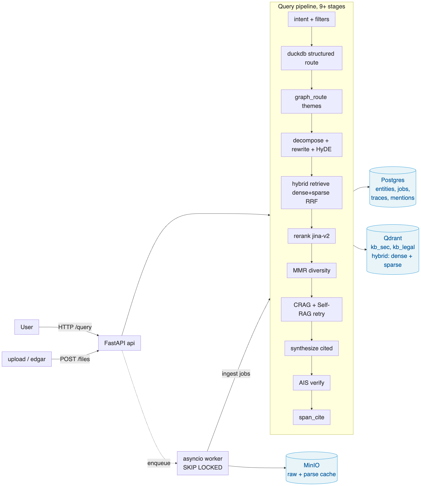

# Knowledge Base: Submission Brief

**Repository:** [github.com/sarthak-fleet/knowledge-base](https://github.com/sarthak-fleet/knowledge-base)

Short brief. The depth lives in the repo:

- [NOTES.md](https://github.com/sarthak-fleet/knowledge-base/blob/main/NOTES.md): decision log with research links.
- [DESIGN.md](https://github.com/sarthak-fleet/knowledge-base/blob/main/DESIGN.md): architecture detail and the boundary tests for the domain-agnostic claim.
- [README.md](https://github.com/sarthak-fleet/knowledge-base/blob/main/README.md): bootstrap, endpoints, reading guide.

What I built supports schema-defined domain onboarding: drop a YAML, drop in files, ask questions, get cited answers. The schema layer (`src/kb/schema`) and the vector store (`src/kb/vector`) carry no domain identifiers. Grep confirms zero hits for SEC, Legal, ticker, FinancialMetric, RiskFactor, or Clause across either directory. The two-domain demo (SEC EDGAR + SPDX legal licenses) runs the schema-swap path on the same code.

An earlier iteration left four files in `src/kb/query` and `src/kb/extract` with SEC-flavoured defaults baked into code: `graph_route.py` branched on `domain == "sec"` for its default entity type, the intent classifier's few-shot examples were SEC-only (Apple, NVDA, EPS-Diluted), the DuckDB route had a `TICKER_FROM_FILENAME` regex inline, and `xlsx_bridge.py` was explicitly financial-metric specific. The latest commit set moved all four to `domains/<name>/config.yaml`. Defaults are null/empty in `src/kb/config/defaults.yaml`, so a new domain that doesn't configure them just doesn't fire those routes. The Legal demo proves the schema-swap path (schema, retrieval, citations) but doesn't exercise the financial-shape stages because its questions don't trigger them. That's a coverage gap, not a code-level domain leak.

## 1. Architecture

Three stores, each with one job. Postgres holds the versioned schemas, the entities the pipeline extracts (lineage walked via recursive CTEs), and the ingest job queue. `SELECT ... FOR UPDATE SKIP LOCKED` makes that a real queue without bringing in Celery. Qdrant holds the chunks, with native dense + sparse hybrid and RRF fusion; a pgvector adapter is shipped behind the same Protocol so the choice isn't permanent. MinIO holds raw bytes and cached parse artifacts. Workers fan out as an asyncio pool, with per-file failures bounded so one bad PDF doesn't poison the rest of the index.

## 2. The three trickiest decisions

**Parse once, re-extract many.** The rubric requires that re-running schema-driven ingestion not redo the expensive parsing work. The question was where to put the cache.

I rejected three alternatives. Caching chunked text loses bbox and page provenance, which breaks citation. Caching the LLM extraction output is useless: schema changes are exactly what invalidates it. Caching only the raw file bytes does nothing for the expensive part, which is OCR and `hi_res` layout detection (a 300-page 10-K on `hi_res` can take several minutes and >2 GB RAM).

What landed is a cache at the Unstructured `Element` boundary, keyed on `sha256(file_bytes)`. `Element` preserves bbox, page number, and element type, which is everything the chunker, the schema-driven extractor, and the citation stage need downstream. A `parse_artifacts` table maps `(content_hash → object_key)` to a JSON blob in MinIO. Schema edits create a new `ingest_jobs` row keyed on `(file_id, schema_id)`. The parse-cache hit makes re-extract substantially cheaper than re-parsing: the LLM extraction call still runs, but `partition_pdf`, tesseract, and `hi_res` don't.

**Layered retrieval.** Each layer in the pipeline catches a different failure class, which is why the pipeline has 9+ stages instead of 3.

Pure-dense retrieval can't reliably find rare tokens like ticker symbols ("AAPL") or item codes ("Item 1A"); pure-sparse can't find paraphrase. Hybrid retrieval pairs `bge-large-en-v1.5` dense vectors with `bm42` sparse vectors and fuses the ranked lists via Reciprocal Rank Fusion. RRF was the deliberate choice over score-based fusion because it doesn't need calibration between the two retrievers. Cross-encoder rerank (`jinaai/jina-reranker-v2-base-multilingual`) sits on top, reading (query, chunk) jointly and producing the precision score that bi-encoders can't. It's the single largest precision lift before synthesis.

For aggregate questions ("which companies had revenue over $60B?"), the engine bypasses retrieval entirely and generates SQL against the entities table in DuckDB. The intent classifier flags aggregate shape and the structured route fires. DuckDB was chosen over a separate analytical DB because it runs in-process: no extra service to operate, and it registers entities as a view cheaply.

The MMR diversity reranker is opt-in per-domain rather than always-on, and the reason is a small case study in why a global retrieval default is the wrong shape. I added it expecting modest diversity gains and got opposite signs on the two demos: it regressed SEC citation F1 by 0.13 and lifted Legal by 0.09. 10-K boilerplate questions ("what does NVIDIA disclose about export controls?") want the same chunks ranked high, not diverse ones. License-text questions want spread across clauses. Same code, opposite signs. Diversity-vs-precision is a per-domain choice, not a global setting.

Per-claim verification closes the loop. After synthesis, each generated claim plus its asserted citation is sent through an entailment check (AIS-style, Rashkin 2021). Per-claim is the right grain: per-sentence is too aggressive and costs roughly 10pp fluency for 40pp attributable-rate (Liu 2023). Failed claims downgrade the answer's confidence proportionally.

**Citation as a first-class invariant.** The rubric's hardest line is "cited or it didn't happen": uncited answers are wrong answers. Treating that as an enforced data invariant rather than a prompt-level hope shaped a lot of the design.

Every retrieval path converges on the same triple, `(file_id, page, excerpt)`. Hybrid retrieval gets it natively from chunk metadata. The DuckDB route synthesises citations from the `mentions` table that links each entity back to its source span. Theme-based retrieval (the GraphRAG sketch) backfills citations from the `entity_mentions` of the contributing entities, deduped by `(file_id, page_start)`. The low-confidence retry path inherits citations from whichever stage produced its candidates. There's no path where the synthesiser sees text without a backing citation it can cite.

`span_cite` is the last stage. Given a chunk and a claim, it picks the best sentence inside the chunk by dense cosine and surfaces that as the highlighted excerpt. Citations end up page + best-sentence-accurate rather than only page-accurate. Confidence is downgraded proportionally to per-claim verify pass rate, so "the model said it with a citation" and "the citation re-verified" carry different confidence values. The rubric asks for a confidence signal with a reason; this is the reason.

## 3. What I'd do differently with more time

In rough priority order: real graph storage replacing the current theme-routing sketch (community detection on the entity co-mention graph would give themes a reusable structure across queries); a larger natural-question eval set per domain to push variance below the noise floor; a structured model-and-config benchmark sweep — every model lever is already an env var (`KB_EMBED_MODEL`, `KB_RERANK_MODEL`, `AI_MODEL`, `KB_VECTOR_STORE`), so the missing piece is a `make bench` target that runs eval across N (embedder × reranker × synth) combinations and produces a comparison table; Qdrant collection consolidation to one collection per project with `kind` as a payload field (today: one collection per kind, which is fine at 1–10 kinds per project but gets expensive past 30; the fan-out is in the engine, not the storage layer, so it's a swap-the-collection-naming refactor when needed); per-token SSE streaming on `/query`; a memory-aware semaphore per pipeline stage so worker concurrency stops being a count-based knob; SEC EDGAR fixtures committed alongside the existing Legal ones so `make seed` runs fully offline.

## 4. Where it breaks today

- **Without an LLM key, structured extraction yields zero entities.** Chunks still ship to Qdrant so retrieval keeps working, but the schema-driven outputs and the DuckDB aggregate route both go quiet.
- **Cross-file entity merging is one-pass.** A duplicate arriving later under a slightly different display name creates a near-duplicate canonical. A nightly reconciliation pass would fix it; not shipped.
- **Citations are page + best-sentence-accurate, not character-accurate.** True character-range highlighting in the original PDF would need a sentence-back-to-bbox mapping.
- **Worker memory is count-bounded, not RAM-bounded.** Default concurrency is now 2 (safe on a 16 GB host); `.env.example` has a sizing guide by RAM. The proper fix is a memory-aware semaphore per stage so `hi_res` parsing of a 300-page 10-K can't OOM a small VM even when the count is lifted.
- **SEC seed depends on live EDGAR.** `make seed` pulls 10 10-K filings live; on failure it falls back to XLSX-only (`src/kb/seed/sec_seed.py:116`). Legal seed reads committed fixtures from `domains/legal/fixtures/` first, so `make seed-legal` runs offline. SEC fixtures aren't committed because each filing is several MB; queued in §3.

---

The remaining rubric items (schema versioning with NL field descriptions, identity merging, lineage, idempotency, scoped + filtered + conversational retrieval, layered configurability) are represented in the implementation under `src/kb/`; the [source-tree map in README](https://github.com/sarthak-fleet/knowledge-base/blob/main/README.md) walks through where each one lives.
