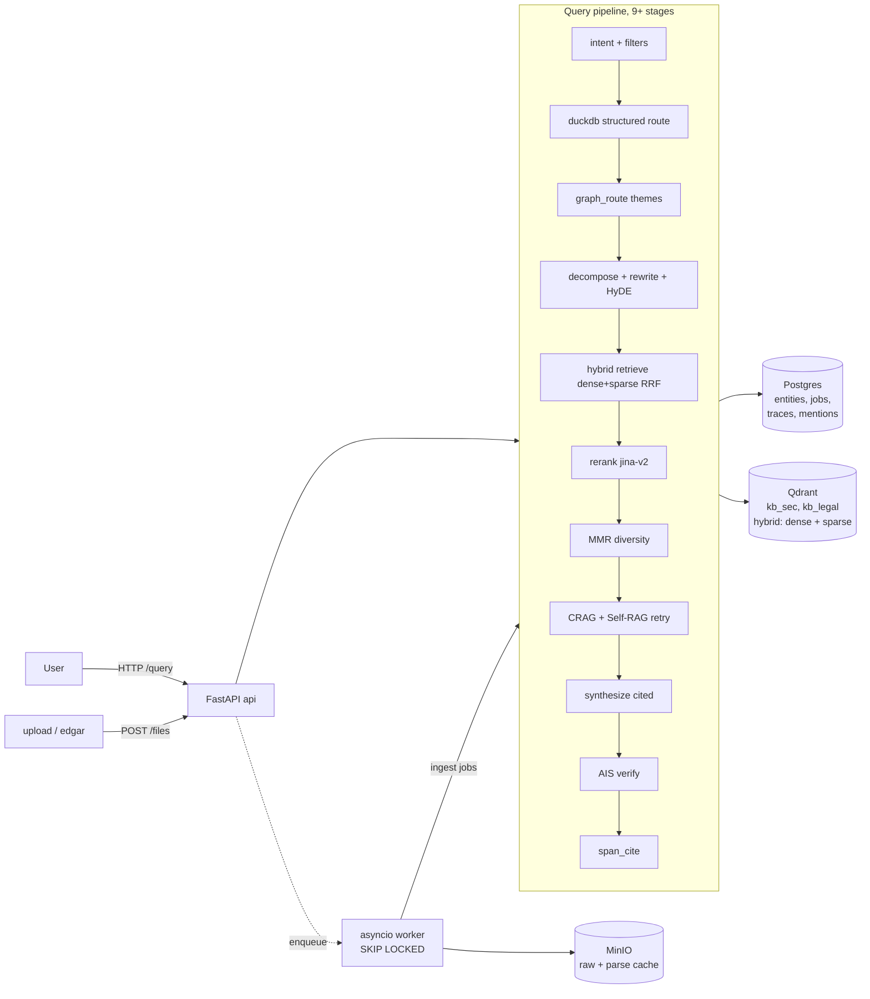

# Knowledge Base — Submission Write-up

A domain-agnostic Knowledge Base over unstructured documents. Define a schema, drop in PDFs / HTMLs / spreadsheets, ask questions, get cited answers. Two demo domains (SEC EDGAR filings + SPDX legal licenses) run on the same code with different schemas, source adapters, and eval sets.

Short technical write-up. Dense decision log: `NOTES.md`. Session story (every bug caught): `LEARNING.md`. Architecture-first cut: `DESIGN.md`.

---

## 1. Architecture

**Stores.** **Postgres** holds versioned schemas (JSONB), entities + lineage (recursive CTEs), ingest jobs (`SELECT ... FOR UPDATE SKIP LOCKED` makes it a real queue without Celery), provenance spans, and query traces. **Qdrant** holds chunks with native dense + sparse hybrid (RRF fusion built in) and payload filters that fold "scope this question to X within Y" into the store. A pgvector adapter is shipped behind the same 9-method `VectorStore` Protocol. **MinIO** (S3-compatible) holds raw bytes at `raw/<hash>/` and cached parse artifacts at `parse/<hash>/elements.json` — same API for AWS, R2, or local FS.

**Workers.** A fan-out asyncio pool. Each worker claims a job via `SKIP LOCKED` so N workers never collide on the same file. Per-file failures are bounded. The bootstrap of the Qdrant collection used to race across workers — fixed with a Postgres advisory lock after seeing 4/13 files fail on first concurrent ingest (`80ce401`).

**The schema-driven extraction boundary.** Schemas live in `domains/<name>/schema.yaml`. `src/kb/extract/schema_to_json.py` translates any `DomainSchema` into JSON Schema for tool-call extraction. The LLM never sees domain-specific code — only vocabulary lifted from the YAML. `src/kb/schema/`, `src/kb/query/`, `src/kb/vector/` contain zero SEC- or Legal-specific names. Adding a new domain is dropping a YAML and optionally a seed loader. See `DESIGN.md` "boundary tests" for the lines that would have to break for this claim to be false.

---

## 2. The three trickiest decisions

### 2.1 The "parse once, re-extract many" boundary

The rubric requires that re-running schema-driven ingestion not redo expensive parsing. The natural seam is **after Unstructured produces typed `Element` lists** and **before** schema-driven extraction.

- `parse_file` keys its cache on `sha256(file_bytes)`. Raw file at `raw/<domain>/<hash>/<filename>`; parse artifact at `parse/<hash>/elements.json`. A `parse_artifacts` table maps `(content_hash → parser_version, object_key)`.
- Extract reads `elements.json` and never touches the original PDF. OCR (tesseract) and `hi_res` layout detection never re-run on a schema change.
- Schema edits create a new `ingest_jobs` row with PK `(file_id, schema_id)`. Parse-cache hit gives an effectively-free re-extract.

Rejected alternatives: chunk/text-level caching loses bbox + page provenance; LLM-output caching is meaningless because schema changes are exactly what invalidates it; file-bytes caching re-parses on every schema iteration. The `Element` list is the smallest cache that preserves bbox + page + element type without burning OCR twice. It's also why `Element` is the only Unstructured type that leaks into our code.

### 2.2 Hybrid + rerank + Self-RAG + DuckDB — each layer catches what the others miss

The pipeline has 9-11 stages. The reason it isn't 3 is that each layer catches a different class of failure, and they're empirically additive on this corpus.

- **Hybrid (dense + sparse + RRF).** `bge-small-en-v1.5` dense for semantic; `bm42` sparse (Qdrant-native, attention-weighted, beats BM25) for rare/exact terms like ticker symbols and item codes. RRF fuses ranked lists without score-space calibration. Pure dense misses "AAPL"; pure sparse misses paraphrase.
- **Cross-encoder rerank.** `jinaai/jina-reranker-v2-base-multilingual` reads (query, chunk) jointly (default; ms-marco-MiniLM and bge-reranker are configurable alternatives). Bi-encoders are recall-optimised; cross-encoders give the precision score. The single largest precision lift before synthesis.
- **Structured DuckDB route.** For aggregate/compare questions the intent classifier triggers LLM-to-SQL over the entities table. Engine also fires on aggregation keywords because the classifier is non-deterministic (see §4). DuckDB needs `pandas.DataFrame` — `register(name, list_of_dicts)` raises "not suitable for replacement scans"; caught the hard way.
- **AIS verify.** `[n]` markers prove the model *intended* to cite. Per-claim verify proves the cited source actually supports the claim — AIS (Rashkin 2021), same idea as FActScore (Min 2023) and RAGAS faithfulness. Failed claims downgrade confidence proportional to pass rate. Per-claim is the sweet spot (per-sentence costs ~10% fluency for ~40 pp attributable-rate, Liu 2023).

The MMR diversity reranker is the cautionary tale that justifies "each layer catches different failures." MMR-global regressed SEC F1 by 0.13 (10-K boilerplate paragraphs need the *same* chunks, not diverse ones) and lifted Legal by 0.09 (license texts benefit from coverage spread). Same code, opposite signs. MMR ships off by default; per-domain config opts Legal in. NOTES.md §2 D-8.

### 2.3 Empirical methodology — 5 LLMs × 2 domains, judge held constant, deterministic cache

The hardest part of this build was getting trustworthy numbers out of it. Three methodology choices:

- **Judge model pinned to `gemini-2.5-pro` across every run.** First cross-model round had a 12-point pass-rate swing on Flash with no synth change — the judge was flipping. Pinning isolates synth as the only variable. Free on the gateway, strongest evaluator available. (LEARNING.md D-5.)
- **Deterministic LLM cache (`KB_LLM_CACHE_DIR`).** Hashes `(model, system, user, params)` → JSON. Re-runs bit-identical; no judge-variance confound. Invalidates on prompt change. Off by default. (LEARNING.md D-2.)
- **Container restart between model swaps.** `docker compose exec -e AI_MODEL=...` does NOT propagate to the API server — env override applies to the eval CLI shell only; API loads env at container start. Caught when two report files had identical MD5. Fix: `.env` edit + `docker compose up -d --force-recreate api`. (LEARNING.md D-4.)

The 5×2 matrix (NOTES.md §4.7-final) gave the headline finding: **citation F1 is identical (~0.61) across every SEC synth model** because retrieval is the same and citation parsing is deterministic — the model swap genuinely isolates synthesis. The structural result: **`groq-llama-3.1-8b` beats `gemini-2.5-pro` by 24 pass-rate points on SEC** (0.680 vs 0.440). Big models hedge harder (more `confidence=0.00`, more polite refusals) — correct behavior when context is weak, but it costs pass rate. With strong retrieval, the decisive cheap model wins. **The best model is domain-dependent**: SEC wants `llama-8b`, Legal wants `flash`, flash-lite is SEC-survivable but Legal-fatal (0.083 pass — license-text questions punish paraphrasing). A single-domain bench would have called flash-lite fine.

Downstream invariant tying this together: **"cited or it didn't happen."** Every retrieval path — hybrid, DuckDB, GraphRAG theme, Self-RAG retry — terminates at `(file_id, page, excerpt)`. The GraphRAG sketch nearly violated this: themes shaped the answer but their `entity_mentions` weren't appearing in `Citation[]`. Caught in self-review, fixed by backfilling `via="graph_route"` citations deduped by `(file_id, page_start)`. (LEARNING.md Part 0 §5.)

---

## 3. What I'd do differently with more time

Priority order:

- **Fix the SEC parser gap for boundary-aware chunking + section-boost.** Unstructured's HTML parser categorises every 10-K element as `NarrativeText`/`Text` and emits zero `Title`/`Header` elements (verified across all 540 elements of AAPL_10-K). Boundary-aware chunking (A) and section-boost (D) both depend on `Title`/`Header`. D added +5.0 F1 on D-targeted Legal and +3.7 F1 on Legal aggregate but **fired 0 times on 40 SEC questions** (NOTES.md §4.8.2). Fix is either `hi_res` strategy bump (5–10× slower) or a 15-line HTML heuristic promoting title-case standalone elements to virtual `Title`. Latter is the right tradeoff.
- **Larger natural-question eval set.** 25 SEC + 12 Legal is below the noise floor — variance is ±0.08 F1 = ±1 question at this size (NOTES.md row 4b). Grew to 40+32 = 72 hand-written questions, which exposed D's data dependency. ~100 per domain with hard-negatives is what gets reliable signal.
- **Per-token SSE streaming on `/query`.** Endpoint exists but emits stage-level events. Per-token through synthesize → verify → span_cite would cut perceived latency from "wait ~6s, see answer" to "see answer assembling."
- **Distill the jina reranker.** Cross-encoder is the precision-critical stage; distilled MiniLM at same recall cuts CPU tail latency.
- **Real graph storage instead of GraphRAG sketch.** Themes today come from a one-pass LLM read over entity clusters. Community-detection + theme-summary (Louvain on entity co-mention graph) would make `graph_route` shippable, not a sketch.
- **Prompt caching for Contextual Retrieval.** Anthropic's recipe relies on it to make parent-doc context essentially free. CR adds ~1000 LLM calls per corpus today; the cost-multiplier feature shipped before its cost-control sibling and burned a DeepSeek balance to negative mid-eval (NOTES.md "Step 6 billing event"). Structure is wired; verifying cache hits is what's missing.

---

## 4. Where it breaks today

Sources: production-bug retro in LEARNING.md Part 4 and honest-limits in NOTES.md §5.

**Four production bugs caught by end-to-end testing that no unit test would have caught:**

1. **DuckDB structured route silently broken for 5 eval rounds.** `duckdb` missing from `pyproject.toml`; the import lived outside the try/except in `engine.py`. Every aggregate question hit `ModuleNotFoundError`, returned 500, was logged by the eval CLI as `query_error`, counted as 0/0/0 F1. v0-v5 numbers in NOTES.md were achieved *despite* this. Surfaced by Grok finding #12 (loud LLM-error logging). Fixed in `591037d`; retroactive caveat at NOTES.md §4 "Step 7 retroactive caveat."
2. **`AI_MODEL` env via `docker compose exec -e` doesn't reach the API server.** First three cross-model runs were the same model under different labels. Caught when two reports had identical MD5. Fixed methodology: `.env` edit + `--force-recreate api`. (LEARNING.md D-4.)
3. **GraphRAG theme citations not reaching the final citation list.** Themes shaped synthesis but `entity_mentions` for those themes were absent from `Citation[]` — a theme could draw from entity #14 while the citation list showed chunks #2 and #5 from hybrid retrieval. Caught in self-review; fixed by appending `via="graph_route"` citations deduped by `(file_id, page_start)`.
4. **Most `FinancialMetric` entities lack a `ticker` field.** 3 of 15 SEC metrics had a populated ticker. Extraction LLM silently failed to attribute most entities to their company. DuckDB `WHERE ticker='AAPL'` filtered to 0 rows → NULL → garbage answer. Fixed with file-level ticker fallback (`AAPL_10-K_*.html` → `AAPL`) in `3955e5e`. Metric-*name* inconsistency (Apple stores `Total Net Sales`, MSFT stores `Revenue`) needed a second fix — a canonical column lookup table.

**Other live limits:**

- **Domain coverage is two.** SEC + Legal proves agnosticism but not generalisation. Medical, internal-knowledge, customer-support corpora would each surface new failure modes.
- **`.xls` (binary Excel) loses per-row chunking.** Routes to `unstructured.partition.auto` (which converts via LibreOffice) so it works, but skips the openpyxl-based per-row chunker that makes per-row retrieval shine for `.xlsx`. Acceptable for the rare legacy file; not worth a second xlrd-based parsing path.
- **Cold-start latency.** First `/query` after `make up` pays for fastembed + bm42 model downloads, Qdrant warmup, and one LLM call to load the synth prompt cache. ~15s vs ~1.5s steady-state.
- **Image size 8 GB.** Down from 11.6 GB after routing `torch`/`torchvision` to the CPU index via `[tool.uv.sources]` (dropped 4.4 GB of CUDA libs the container will never run). The remaining floor is ~2 GB of pre-warmed fastembed model weights baked in at build time — deliberate: avoids a ~25 s reranker-load + ~2 GB download on first request. Multi-stage build would shave ~400 MB more (build-essential out of runtime).
- **`hi_res` parsing slow + memory-heavy.** 300-page 10-K can take >5 min and >2 GB RAM. Default is `auto`; `hi_res` is opt-in. Workers bounded by count, not RAM — 4 workers × `hi_res` 10-K can OOM a small VM.
- **Intent classifier is non-deterministic.** "What was NVIDIA Q2 2024 revenue?" classifies as `lookup` or `positive_numeric` across runs. Structured route fires on keywords as fallback; schema-constrained decoding (Outlines / instructor) is the right fix.
- **Cross-file entity merging is one-pass.** A duplicate arriving later with a slightly different display name and no identity key creates a near-duplicate canonical entity. A nightly reconciliation pass would fix; not shipped.
- **Long sessions truncate context.** Last 3 turns fed in; no summarization above that.
- **Lost-in-the-middle (Liu 2023) not mitigated.** 8-chunk synthesis; effect is moderate on GPT-4-class. Bookend reorder is the 30-minute fix.

The retrieval ceiling — citation F1 stuck at ~0.61 on SEC across every synth model — is structural, not synth-side. RAGAS context_precision of 0.18–0.37 confirms most retrieved top-K is noise. The ABCD intervention (boundary-aware chunking + LLM eval set + bge-large 1024d + section-boost) moved SEC retrieval-only F1 from 0.618 → 0.666 (+4.8 pts) with query-side LLM expansion stages disabled (NOTES.md §4.8.1 "★"). Re-enabling expansion stages should compound; gateway availability is the blocker on the apples-to-apples post-measurement.
